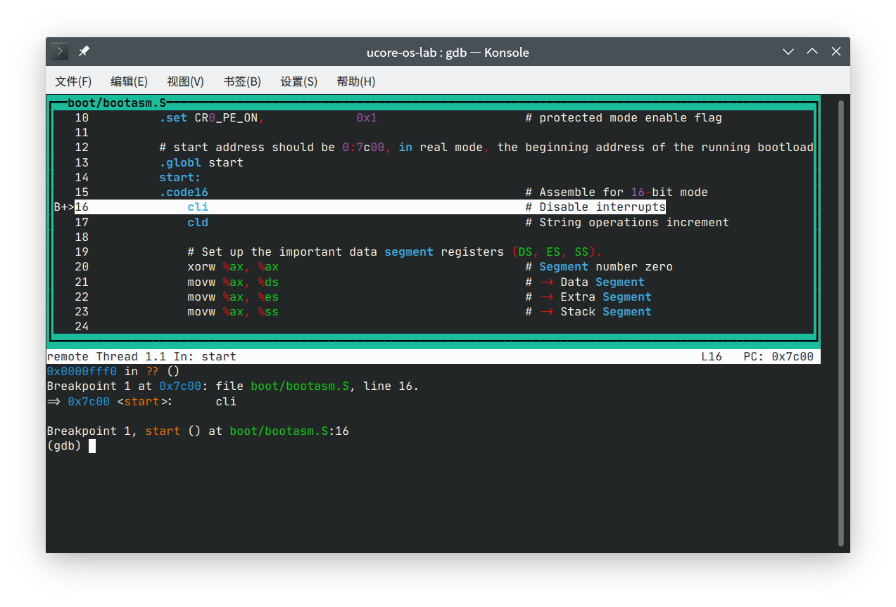

# Lab 1, Ex 2: 使用 QEMU 和 GDB 运行和调试程序

## GDB 启动配置

首先修改 GDB 配置文件 `tools/gdbinit`：

```
file obj/bootblock.o
target remote :1234

define hook-stop
x/i $pc
end

break *0x7C00
continue
```

这里首先加载了 `obj/bootblock.o` 目标文件作为调试对象。

刚开始尝试了 `file bin/bookblock`，结果提示 `"/.../bin/bootblock": not in executable format: file format not recognized`，思考之后意识到 `bin/bookblock` 这个文件里面已经只有纯粹的二进制机器指令，不包含任何额外信息了，于是转而导入了 ELF 格式的 `obj/bootblock.o`，里面包含符号、注释等信息。

第二行通过 1234 端口连接到 QEMU。

中间部分定义了 `hook-stop` 钩子函数，在每次断点停住时反汇编并打印当前 PC 寄存器中的指令。

最后在 bootblock 的 0x7C00 处打断点，也即是操作系统的第一条指令处。然后启动操作系统。

## 启动调试

运行 `make debug-tui`（这里对 Makefile 做了一些改动，修改了部分 target 名称），可以看到成功启动了 QEMU，随后启动了 GDB，并成功断点。



## 单步跟踪并比较反汇编与源代码

由于 `obj/bootblock.o` 里面包含了 `boot/bootasm.S`，GDB 的 `file` 命令正确的加载到了 bootblock 的源码。确实和真实源码一致。

`obj/bootblock.asm` 是通过 objdump 命令从 `obj/bootblock.o` 反汇编出来的，可以看到里面已经有了各指令的实际装载位置，比如第一条指令 `cli` 在 0x7C00。并且，这里面还包含了 `boot/bootmain.c` 所编译出的指令的汇编。除此之外，指令中指示字长的标记也没有了，比如 `movl`、`movw`、`movb` 全都变成了 `mov`。不过这里面还是可以对照地看到原始的汇编源文件的内容。

程序运行时，由 `hook-stop` 输出的反汇编基本和 `obj/bootblock.asm` 中的反汇编一致。

## 调试内核代码

在 GDB 中运行如下命令：

```
file bin/kernel
break kern_init
continue
```

在 `kern/init/init.c` 文件中的 `kern_init` 函数开始处打了断点，然后继续运行到该断点。

可以看到程序确实停在了该函数起始位置，并且 GDB 正确的找到了相应的 C 源码。

分别尝试了使用 `next`（`n`）、`nexti`（`ni`）、`step`（`s`）、`stepi`（`si`） 来单步调试代码，作用分别是运行源代码的一行（不进入函数）、运行一条机器指令（不进入函数）、运行源代码的一行（进入函数）、运行一条机器指令（进入函数）。其中 `nexti` 和 `stepi` 单步运行指令时，`hook-stop` 输出的反汇编和 `obj/kernel.asm` 中的反汇编一致。

## 验证 BIOS 的启动过程

为了验证 BIOS 的启动过程，新建 `tools/gdbinit_bios`，内容如下：

```
set architecture i8086
target remote :1234
```

再次运行调试（需在 Makefile 添加一个 target，指定使用新的 GDB 配置文件），此时系统会停在 CPU 刚上电，运行第一条指令之前，通过 GDB 命令 `i r cs`（全称为 `info registers cs`）和 `i r eip` 可以看到初始时 CS 和 EIP 寄存器的值确实分别为 0xF000 和 0xFFF0，所代表的地址也就是 `(0xF000 << 4) + 0xFFF0`，即 0xFFFF0。

这里的 0xFFFF0 是 16 位模式下（只有 20 位地址空间）的初始指令地址（映射到 ROM），在 32 位模式下（有 32 位地址空间），这个地址实际上被理解成 0xFFFFFFF0（高 12 位初始时被置为 1，直到执行第一条跨段跳转指令时，会恢复为 0）。

此时通过 `x /2i 0xffff0` 确实看到了 BIOS 最开始的两条指令，第一条是一个长跳转 `ljmp $0x3630,$0xf000e05b`。

## 参考资料

- [BIOS 启动过程 - 实验指导书](https://chyyuu.gitbooks.io/ucore_os_docs/content/lab1/lab1_3_1_bios_booting.html)
- [启动后第一条执行的指令 - 实验指导书](https://chyyuu.gitbooks.io/ucore_os_docs/content/lab1/lab1_5_appendix.html)
